# DevJobInfo

An AI-powered job hunting assistant. Set up your profile once, then let the agent find relevant jobs, score them against your actual skills, research each company, generate a tailored cover letter and resume, and tell you who in your network to reach out to — all before you click Apply.

**Live:** [devjob.info](https://devjob.info)

This is the public showcase for the project — README, architecture notes, walkthrough videos and screenshots. The application code lives in a private repository.

---

## Walkthrough

<a href="https://friis1978.github.io/devjob-info-public/walkthrough-voiced.mp4?v=20260830d">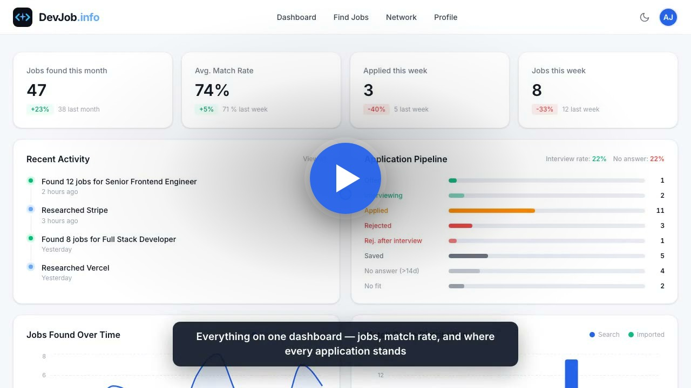</a>

Click the thumbnail to watch the ~147-second narrated tour — dashboard, profile, job search and match breakdown, the Chrome extension saving a job in one click, company research with brand-matched theming, a cover letter (built from your own saved snippets, with an AI-written headline, an AI-detection rewrite, and ATS-aware regeneration) and an ATS-reviewed tailored resume, generated live against a real posting. Every AI feature runs on your own API key — no subscription, no lock-in to one provider.

Recorded with Playwright against a seeded demo account, never a real one.

<!-- The ?v= query param below is a manual cache-buster — bump it (e.g. to
today's date + a letter) any time these video files are replaced. GitHub
Pages/browsers otherwise cache these by filename with no revalidation, so a
republish can go unnoticed by anyone with a warm cache — this bit a real
user once already. -->
- **Narrated:** [walkthrough-voiced.mp4](https://friis1978.github.io/devjob-info-public/walkthrough-voiced.mp4?v=20260830d)
- **Narrated (dark theme):** [walkthrough-dark-voiced.mp4](https://friis1978.github.io/devjob-info-public/walkthrough-dark-voiced.mp4?v=20260830d)
- **Silent:** [walkthrough.mp4](https://friis1978.github.io/devjob-info-public/walkthrough.mp4?v=20260830d)
- **Script** with timecodes: [docs/walkthrough-script.md](docs/walkthrough-script.md)
- **Subtitles:** [docs/walkthrough.srt](docs/walkthrough.srt)

Narration is generated via the Gemini TTS API, not recorded manually.

---

## Why I built it

I wanted something more than a job board — a tool that reads a posting the way a candidate actually would, weighs it against real skills instead of keyword overlap, and does the tedious parts (company research, tailoring a resume per role, drafting the cover letter, tracking who's ghosted you) so the job search itself gets faster instead of just more organized.

It also gave me space to work on things I care about as an engineer:

- multi-provider AI orchestration with graceful fallback, not a single hardcoded model
- structured LLM output (schema-constrained generation, PDF-input review, AI-detection passes)
- careful handling of user-supplied secrets (encrypted BYOK API keys, RLS with no admin exception)
- localization that follows the *data* (a job posting's own language) rather than the app's locale
- product-oriented UI details — sortable/filterable tables, per-document edit history, dark mode as a token override

---

## How it works

Three steps. No manual searching.

| Step | What happens |
|---|---|
| **1. Build your profile** | Enter your work history, skills, and cover letter style rules once. Upload a PDF resume — AI pre-fills everything automatically. |
| **2. Search & score** | Type a job title and location. The agent queries five job boards in parallel and AI scores every result 0–100 against your actual skills. |
| **3. Apply with confidence** | Research the company, generate a tailored cover letter and resume, write a motivation paragraph, find a warm intro in your LinkedIn network — all from one page. |

---

## Features

### Job discovery and AI scoring

Search Adzuna, JobTech, Jooble, CareerJet, and Glassdoor simultaneously. The AI reads every posting against your profile and assigns a match score 0–100, with a breakdown of exactly which skills match and which are missing. You can also paste any job URL directly to import a posting that didn't appear in search.

<table>
<tr>
<td align="center" width="50%"><strong>Job list — light</strong>  <a href="page-images/jobs.jpeg">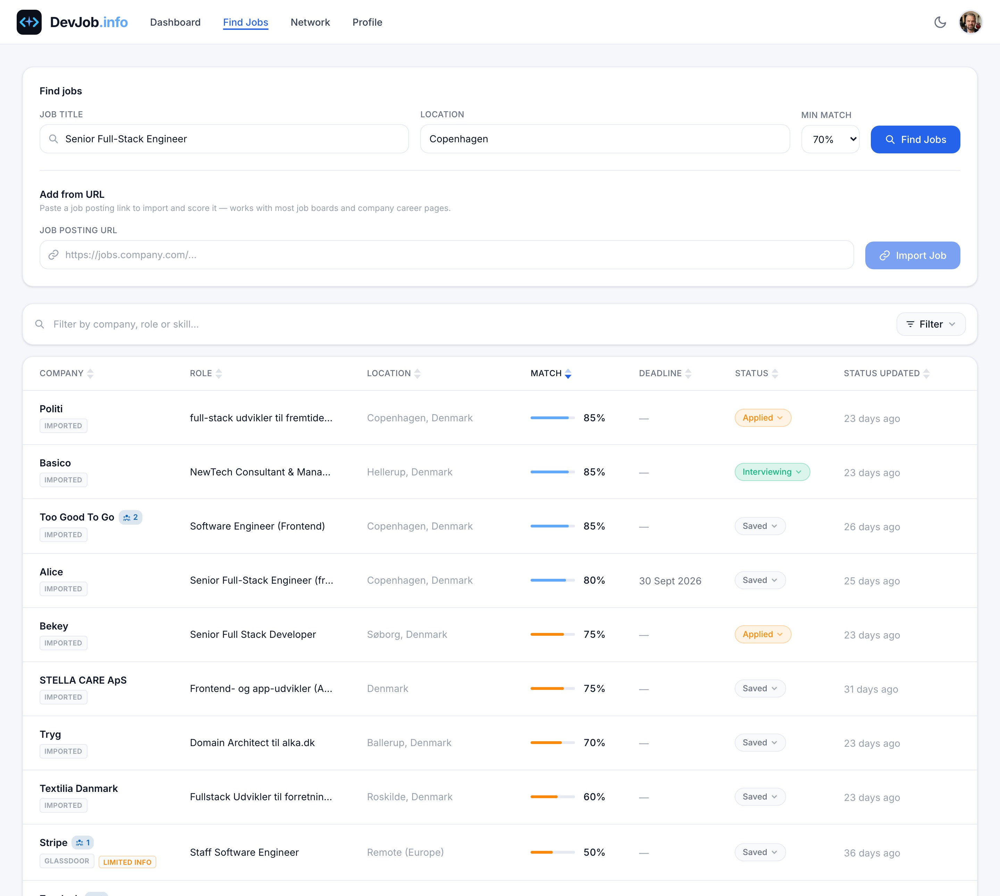</a></td>
<td align="center" width="50%"><strong>Job list — dark</strong>  <a href="page-images/jobs-dark.jpeg">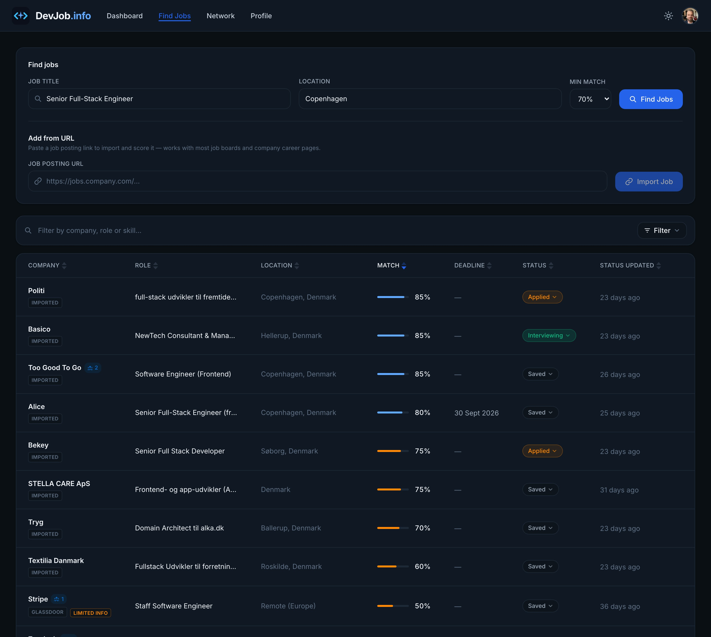</a></td>
</tr>
</table>

Job descriptions are never translated — a Danish posting stays Danish end to end, in the stored description, the AI summary, and the generated cover letter. Language is detected from the posting itself, not the user's locale.

### Company research

One click fetches the company's public site (homepage, About, Engineering/Blog), plus a web search for the original posting to pull contact names and emails, and produces a structured dossier: business overview, tech stack signals, why the role exists, and interview prep talking points. Falls back to AI synthesis from the job description alone if the site can't be reached.

<table>
<tr>
<td align="center" width="50%"><strong>Company research — light</strong>  <a href="page-images/research.jpeg">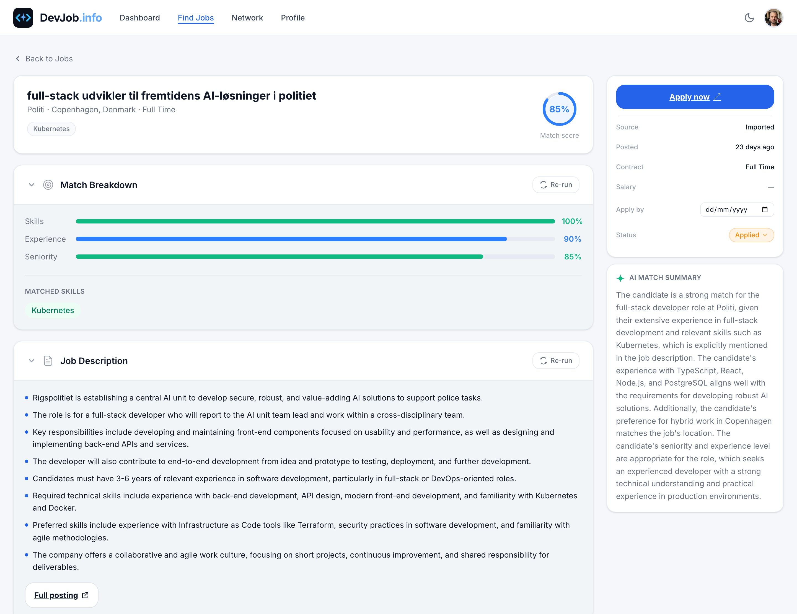</a></td>
<td align="center" width="50%"><strong>Company research — dark</strong>  <a href="page-images/research-dark.jpeg">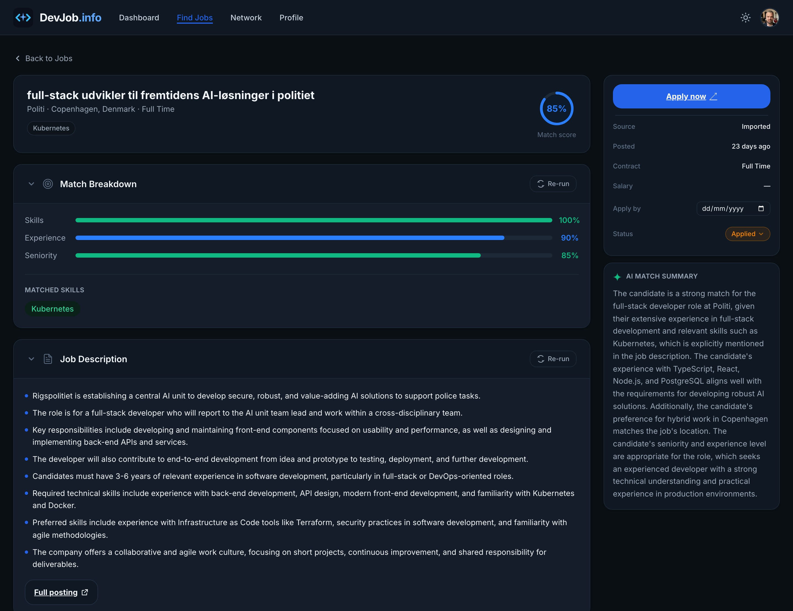</a></td>
</tr>
</table>

### AI cover letter

One click generates a personalised cover letter from your profile, a **snippet library** of your own reusable paragraphs, the full job description, and the company research dossier — always written in the job posting's detected language, an absolute rule that overrides even your own custom instructions. The snippet library grows itself: whenever a job is marked Applied, an AI pass extracts new reusable snippets from the letter you actually sent. A short, brand-colored **headline** is generated above the letter body after the main text is written, so it reflects what the letter actually says.

Every letter is automatically checked against a simulated ATS review — **regenerating** it pulls in any unresolved findings so the new draft actively addresses them, and a manual save re-runs the review too. Letters also run through an AI-detection + rewrite pass so sentences that read as machine-generated get smoothed out before saving. Download as PDF (compact or detailed) or copy as plain text.

### Tailored resume

Generate a job-specific resume PDF in one click, pulling from your full profile and cover letter snippet library as a style reference — plus an on-demand motivation paragraph for the role, which you can steer with feedback on regeneration. Three templates: **Classic** (single column), **Sidebar** (dark left column, default), and **ATS Ready** (a deliberately separate, minimal document with everything a parser has no use for stripped out). Every AI-written section stays fully editable, and edits survive regeneration. Named instruction presets (with a freeform mode) let you fully control the AI's output structure for the cover letter, resume profile, and motivation paragraph.

### ATS review

Simulates an Applicant Tracking System against your resume or cover letter: can the layout be parsed cleanly, and does it contain the keywords the posting asks for in plain extractable text? Findings surface in a dismissible panel per document — no auto-apply, you fix it by hand. This is the one feature with a 5-way AI provider choice, since all five can read PDFs directly.

### Profile and resume builder

<a href="page-images/profile.jpeg">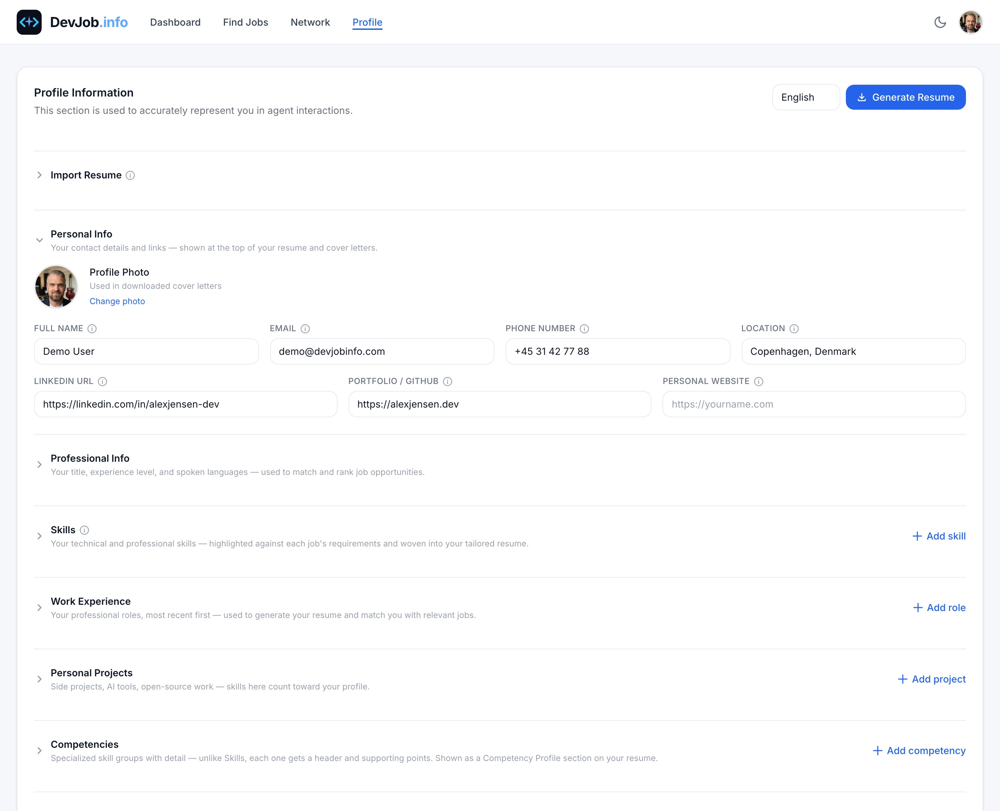</a>

Work experience with reference contacts, education, skills, languages, competencies, certificates, cover letter style rules and examples, LinkedIn recommendations. Generate a profile-only resume (not tied to a specific job) and save it as a public, directly-downloadable link.

### Application pipeline

Jobs flow **New → Saved → Applied → Interviewing → Offer**, with Rejected / Rejected-after-interview / No fit as outcomes. The dashboard's pipeline card tracks applications sent, interview rate, and a **ghost rate** — the share of applications with no reply after the posting's own application deadline closes — with mutually-exclusive buckets so nothing is double-counted.

<a href="page-images/dashboard.jpeg">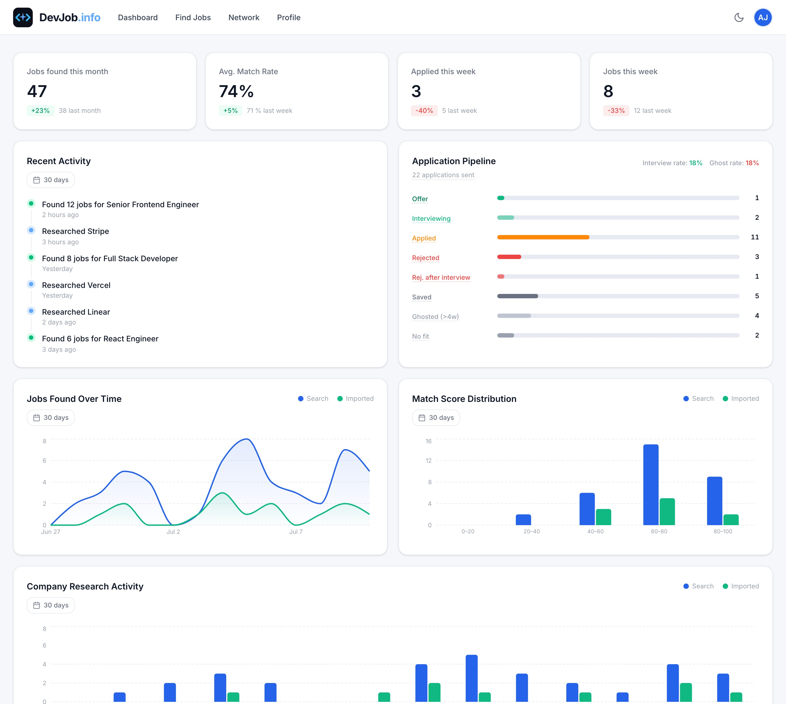</a>

### Network intelligence

Import your LinkedIn connections CSV once. For every job, the AI lists connections at that company, picks the single best person to reach out to and explains why, and drafts a personalised, under-300-character outreach message.

<table>
<tr>
<td align="center" width="50%"><strong>Network — light</strong>  <a href="page-images/network.jpeg">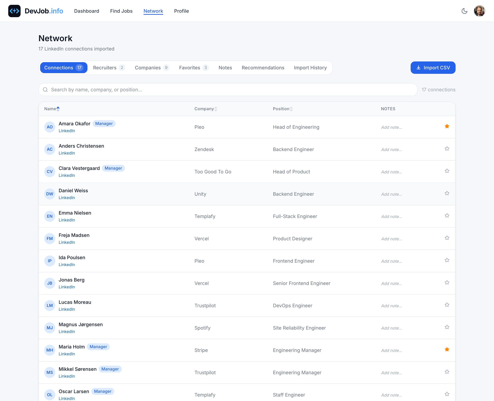</a></td>
<td align="center" width="50%"><strong>Suggested contact + message</strong>  <a href="page-images/network-contact.jpeg">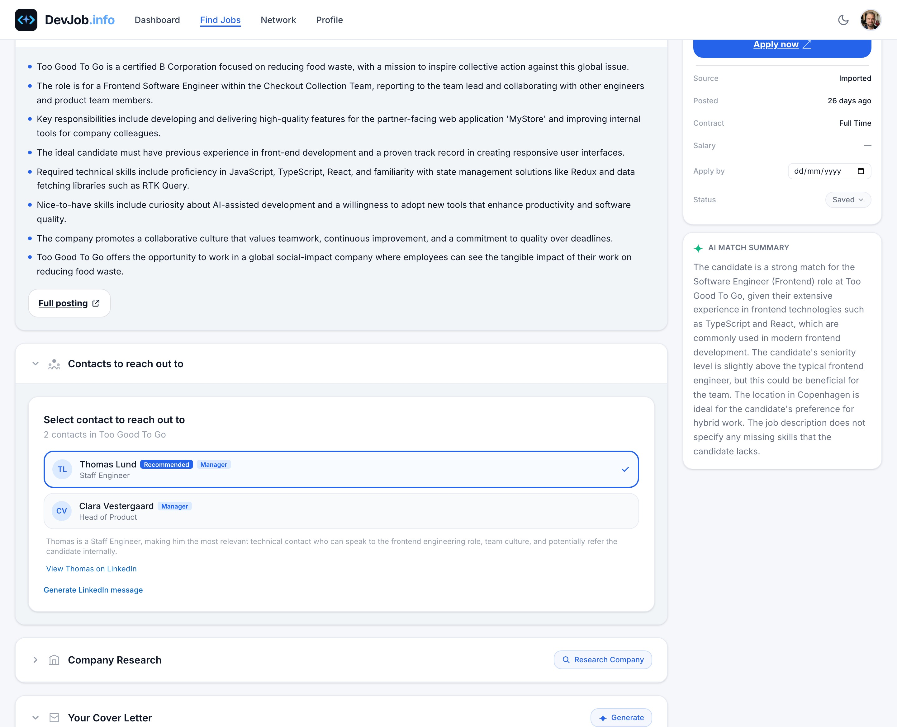</a></td>
</tr>
</table>

### Dashboard and light/dark theme

Application pipeline status, jobs added over time, match score distribution, company research activity, a live activity feed, a 14-day AI token usage chart, and your average weekly AI spend — all backed by PostHog. The whole app supports light and dark mode as a design-token override, following the OS preference on first visit and remembered afterward.

<a href="page-images/dashboard-hero.jpeg">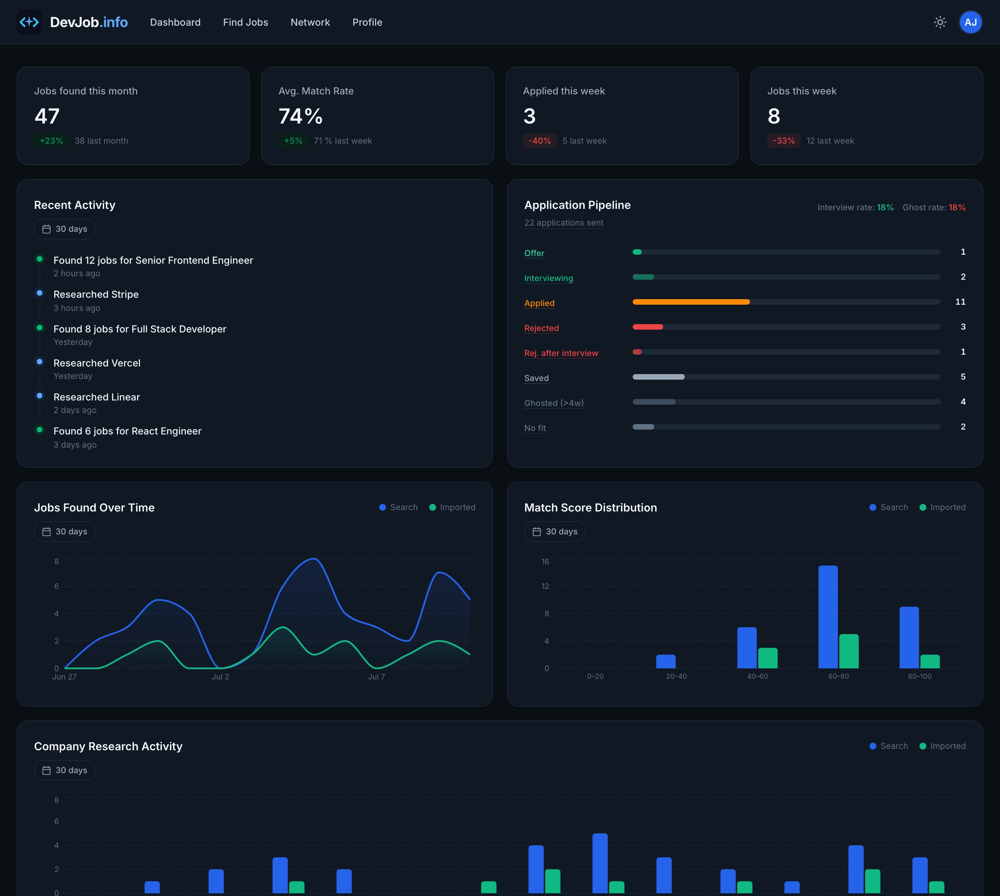</a>

### Bring your own AI key

The app has no billing of its own. Every AI feature runs on the user's own key for whichever provider they've chosen — **Claude**, **Mistral**, **OpenAI**, **Grok**, or **Gemini** — with Gemini as the default for every feature, switchable per feature, plus a one-click "cheapest for everything" option. Keys are:

- stored one-per-provider, never on the main profile row
- encrypted with **AES-256-GCM** before reaching the database
- protected by owner-only RLS with **no admin exception** — not even an admin can read another user's key
- verified against the provider on save, and scrubbed from anything leaving the process (error reporting included)

<a href="page-images/settings-keys.jpeg">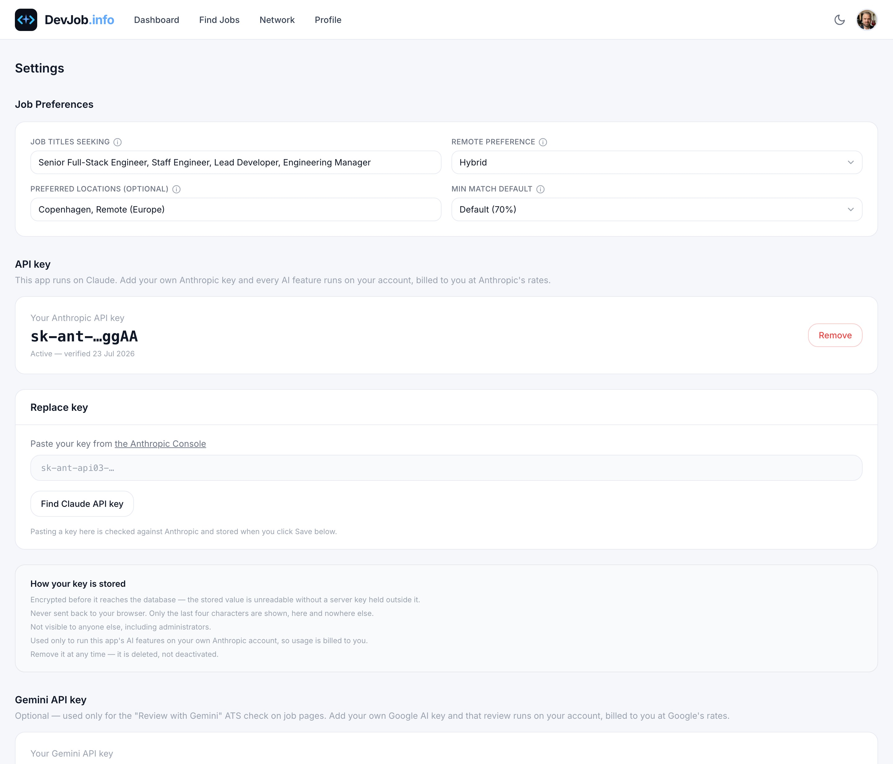</a>

---

## Multi-provider AI architecture

Every AI feature is provider-agnostic. Each of 18 distinct AI features has its own provider preference, chosen independently in Settings, defaulting to Gemini everywhere — switch any feature to Claude, Mistral, OpenAI, or Grok, or use the "cheapest for everything" button to set every feature to the lowest-cost, compliance-audit-verified provider available for it.

Every call site resolves its feature's provider, then routes through a single dispatcher that normalises all five providers' responses to one shape — downstream code never branches on which provider actually ran. Two tiers within Claude's own lineup (shown here as an example): **Sonnet 5** for judgement and writing (scoring, cover letters, resumes, research), **Haiku 4.5** for mechanical work where the answer is already in the input (summaries, translation, targeted rewrites).

If a call to the resolved provider fails for any reason — bad key, rate limit, outage — it retries once against Gemini (if the user has a Gemini key configured) before giving up, so no single provider going down blocks the feature.

An admin-only **AI Provider Compliance Audit** runs all 18 features against a real job on any chosen provider, has Gemini independently grade every result against that feature's actual rules, and records a pass/fail per provider/feature pair — visible to every user in their own provider settings, not just whoever ran the audit.

---

## Feature summary

| Feature | Details |
|---|---|
| Job discovery | Adzuna, JobTech, Jooble, CareerJet, Glassdoor searched in parallel |
| Job import | Paste any URL — AI extracts the posting |
| AI scoring | Scores 0–100 with matched + missing skills per job |
| Company research | HTTP fetch + web search + AI → structured dossier with interview prep |
| Company brand theming | Scrapes accent color + font category from the company site; themes the cover letter and resume PDFs |
| Cover letter | AI-written, language-detected (absolute rule), snippet-library-driven, AI-generated headline, automatic ATS review, PDF + plain text |
| ATS-aware regeneration | Regenerating a cover letter addresses unresolved ATS findings; manual saves re-run the review too |
| Tailored resume | AI generates a job-specific PDF per role, in three selectable templates |
| Instruction presets | Named, saveable AI instructions for cover letter, resume profile, and motivation — freeform mode when customized |
| ATS review | 5-way provider choice (all can read PDFs); findings shown per-document, no auto-apply |
| Fully editable resume | Every AI-written section is editable before download and survives regeneration |
| Resume localization | All section headings — not just AI prose — translated into the job posting's detected language |
| Resume extraction | Upload an existing PDF — AI pre-fills your entire profile |
| Chrome extension | Save the job posting on your current tab to your pipeline in one click, no copy-pasting a URL |
| Network intelligence | LinkedIn connection import, AI contact selection, message generation |
| Application tracking | New → Saved → Applied → Interviewing → Offer, plus Rejected / Rejected-after-interview / No fit |
| Pipeline metrics | Mutually-exclusive funnel: applications sent, interview rate, ghost rate — each with a calculation tooltip |
| Dashboard analytics | Activity, scores, research, and AI token usage charts via PostHog |
| Multi-provider AI | Claude, Mistral, OpenAI, Grok, or Gemini — chosen per feature (18 of them), not a single app-wide switch |
| Bring your own key | Users add their own key per provider; usage is billed to them, not the app |
| AI Provider Compliance Audit | Forces a real job through all 18 AI features on a chosen provider and grades the results automatically |

---

## Tech stack

| Layer | Tool |
|---|---|
| Framework | Next.js 16 (App Router) |
| Backend (DB, Auth, Storage) | InsForge |
| AI models | Claude (Sonnet 5, Haiku 4.5), Mistral, OpenAI, Grok, Gemini |
| Error tracking | Sentry |
| Job sources | Adzuna, JobTech, Jooble, CareerJet, RapidAPI (Glassdoor) |
| Analytics | PostHog |
| Email | Resend |
| PDF generation | @react-pdf/renderer |
| Styling | Tailwind CSS 4 |
| Language | TypeScript (strict) |
